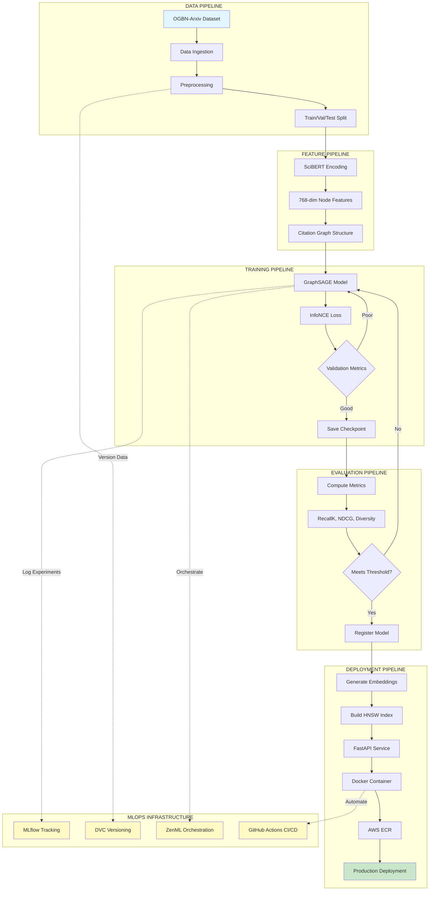

# GraphSAGE Research Paper Recommender System
## End-to-End MLOps Pipeline - Architecture & Workflow

---

## 📊 Project Overview

### What This System Does
A **topological deep learning** recommender that understands the "genetic lineage" of research papers through citation networks, not just keyword matching.

### Core Innovation
**Discovery Engine vs Search Engine:**
- Traditional systems: "Find papers that *sound* similar"
- This system: "Find papers that *think* similar"

---

## 🎯 Why This Architecture Beats Baseline Methods

### Comparison Table

| Aspect | SciBERT + Dot Product | **Our GraphSAGE + InfoNCE** |
|--------|----------------------|---------------------------|
| **Matching Type** | Surface-level semantic | Topological + Semantic |
| **Citation Context** | ❌ Blind to relationships | ✅ Uses 3-hop citation graph |
| **Cross-domain Discovery** | ❌ Keyword-limited | ✅ Finds mathematical ancestors |
| **New Paper Handling** | ❌ Requires retraining | ✅ Inductive, instant embedding |
| **Quality Signal** | Text similarity only | Peer-validated citations |
| **Diversity Mechanism** | MMR post-processing only | Structure + Training + Post-processing |
| **Training Objective** | Cosine similarity (weak) | InfoNCE contrastive (sharp) |

### Three Key Advantages

#### 1. **Ancestor Retrieval** (The "Aha!" Moment)

```
User Query: "Transformer Efficiency"

┌─────────────────────────────────────────────────────────┐
│ SciBERT Only (Surface Matching):                        │
├─────────────────────────────────────────────────────────┤
│ ✓ Efficient Transformer Paper 1                         │
│ ✓ Efficient Transformer Paper 2                         │
│ ✓ Efficient Transformer Paper 3                         │
│ ✓ Efficient Transformer Paper 4                         │
│ ✗ All same topic, no depth                             │
└─────────────────────────────────────────────────────────┘

┌─────────────────────────────────────────────────────────┐
│ Our System (Topological Discovery):                     │
├─────────────────────────────────────────────────────────┤
│ ✓ Efficient Transformer Paper 1       ← Direct match   │
│ ✓ 1990s Low-Rank Matrix Theory        ← 3-hop ancestor │
│ ✓ Attention Mechanism Origins (2014)  ← Methodology    │
│ ✓ Sparse Linear Algebra Paper         ← Foundation     │
│ ✓ Modern Optimization from Physics    ← Cross-domain   │
│ ✓ Hardware-Aware Computing Paper      ← Adjacent field │
└─────────────────────────────────────────────────────────┘
```

**Why This Matters:** Researchers discover the *mathematical foundations* their field is built on, not just similar-sounding papers.

#### 2. **Signal vs Noise** (Quality Control)

| Problem | SciBERT Alone | Our System |
|---------|---------------|------------|
| Buzzword-heavy abstracts | ❌ Can be fooled | ✅ Requires peer validation |
| Self-promotion | ❌ High text similarity | ✅ Citation network filters |
| New paper quality | ❌ No validation signal | ✅ Must fit citation patterns |

**The Key:** GraphSAGE requires **peer validation**. A paper can't rank high unless other researchers actually cited it or its neighbors.

#### 3. **Training Efficiency** (Sharp Embeddings)

| Method | Mechanism | Result |
|--------|-----------|--------|
| **Cosine Similarity** | Maximize dot product | Fuzzy boundaries, papers cluster into "blobs" |
| **InfoNCE (Our Choice)** | 1 positive vs 20 negatives | High-contrast embeddings, sharp distinctions |

**Analogy:** Cosine similarity is like learning to recognize dogs by seeing only dogs. InfoNCE is like learning dogs by seeing 1 dog vs 20 cats—you learn the *precise features* that distinguish them.

---

## 🏗️ System Architecture Overview

### High-Level Component Flow

```
┌─────────────────────────────────────────────────────────────────┐
│                    INPUT LAYER                                   │
├─────────────────────────────────────────────────────────────────┤
│  Paper (Title + Abstract) → SciBERT Encoder → 768-dim vector    │
│                              + metadata features                 │
└────────────────────────┬────────────────────────────────────────┘
                         │
                         ▼
┌─────────────────────────────────────────────────────────────────┐
│               GRAPH NEURAL NETWORK (3-Layer GraphSAGE)          │
├─────────────────────────────────────────────────────────────────┤
│  Layer 1: Aggregate 10 immediate neighbors    (Direct Context)  │
│  Layer 2: Aggregate 5 neighbors-of-neighbors  (Methodology)     │
│  Layer 3: Aggregate 5 third-hop neighbors     (Foundation)      │
│                                                                  │
│  Aggregation: Mean pooling at each layer                        │
│  Output: Final paper embedding (256-dim)                        │
└────────────────────────┬────────────────────────────────────────┘
                         │
                         ▼
┌─────────────────────────────────────────────────────────────────┐
│                   TRAINING (InfoNCE Loss)                        │
├─────────────────────────────────────────────────────────────────┤
│  For each anchor paper:                                          │
│    - 1 Positive sample (paper it actually cites)                │
│    - 20 Negative samples (random papers)                        │
│  → Forces model to learn sharp, discriminative embeddings       │
└────────────────────────┬────────────────────────────────────────┘
                         │
                         ▼
┌─────────────────────────────────────────────────────────────────┐
│               INFERENCE PIPELINE (Two-Stage)                     │
├─────────────────────────────────────────────────────────────────┤
│  OFFLINE (Pre-computed):                                         │
│    - All 2M papers → GraphSAGE → Embeddings → HNSW Index       │
│                                                                  │
│  ONLINE (Query time):                                            │
│    1. User query → SciBERT → 768-dim vector                    │
│    2. Find 5 pseudo-neighbors in HNSW (~5ms)                   │
│    3. Run GraphSAGE forward pass for query (~10ms)             │
│    4. Retrieve top-100 candidates from HNSW (~5ms)             │
│    5. MMR re-ranking for diversity (~5ms)                       │
│    6. Return top-K results                                      │
│                                                                  │
│  Total: ~25-30ms per query                                      │
└─────────────────────────────────────────────────────────────────┘
```

### Three Pillars of Diversity

Our system ensures variety through **three independent mechanisms**:

| Layer | Mechanism | What It Does | Example Impact |
|-------|-----------|--------------|----------------|
| **1. Structural** | 3-hop aggregation | Pulls papers from different abstraction layers | Biology paper → Stats paper → Linear algebra paper |
| **2. Training** | InfoNCE contrastive loss | Prevents embedding space from collapsing into uniform "blobs" | Clear separation between subfields |
| **3. Post-processing** | MMR algorithm | Balances relevance vs novelty in final ranking | "Show me 10 papers, but make sure they're different" |

**Why Three Layers?** Redundancy. If one fails (e.g., graph is sparse), the others compensate.

---

## 📋 Complete MLOps Workflow

### End-to-End Pipeline Visualization



---

## 🔄 Detailed MLOps Components

### 1. Experiment Tracking (MLflow + DagShub)

**Purpose:** Track every experiment, never lose results

| What Gets Tracked | Why It Matters |
|-------------------|----------------|
| Hyperparameters | Neighbor samples [10,5,5] vs [15,10,5] |
| Training Loss | InfoNCE convergence patterns |
| Validation Metrics | Recall@10, NDCG@10, Diversity |
| Model Checkpoints | Restore best performing epoch |
| Embeddings (UMAP) | Visualize paper clusters |
| Inference Latency | Track production performance |

**MLflow UI Features:**
- Compare 20+ experiments side-by-side
- See which hyperparameters drive performance
- Download any past model instantly
- Share results with team via DagShub link

### 2. Data Versioning (DVC)

**Purpose:** Git for data—track every dataset change

**DVC Pipeline Stages:**

```
data_ingestion (Download OGBN-Arxiv)
    ↓
data_preprocessing (Create graph splits)
    ↓
feature_engineering (SciBERT embeddings)
    ↓
model_building (Train GraphSAGE)
    ↓
model_evaluation (Compute metrics)
    ↓
register_model (Save to MLflow Registry)
```

**Key Commands:**
- `dvc repro` → Run entire pipeline (skips cached stages)
- `dvc dag` → Visualize dependencies
- `dvc diff` → Compare dataset versions
- `dvc push` → Upload to S3 remote storage

**Why DVC?**
- **Reproducibility:** Anyone can recreate your exact results
- **Efficiency:** Re-run only changed stages
- **Collaboration:** Share 100GB datasets via S3, not Git

### 3. Pipeline Orchestration (ZenML)

**Purpose:** Automate workflows, cache intermediate results

**ZenML vs DVC:**

| Feature | DVC | ZenML | When to Use |
|---------|-----|-------|-------------|
| Data versioning | ✅ | ❌ | DVC handles this |
| Pipeline caching | Basic | Advanced | ZenML better for complex DAGs |
| Artifact lineage | Limited | Full | ZenML tracks provenance |
| Cloud deployment | Manual | Automated | ZenML deploys to K8s/SageMaker |
| ML-specific | ❌ | ✅ | ZenML has model registry, drift detection |

**Our Strategy:**
- **DVC:** Version data, track experiments
- **ZenML:** Orchestrate training, automate deployment
- **MLflow:** Log metrics, register models

**ZenML Pipeline Benefits:**
1. **Smart Caching:** If SciBERT embeddings haven't changed, skip re-encoding
2. **Parallel Execution:** Train multiple model variants simultaneously
3. **Cloud Flexibility:** Run locally or scale to AWS Batch
4. **Lineage Tracking:** Know exactly which data version produced which model

### 4. CI/CD Pipeline (GitHub Actions)

**Three-Stage Pipeline:**

```
┌──────────────────────────────────────────────────────────┐
│  STAGE 1: TESTING (On every PR)                          │
├──────────────────────────────────────────────────────────┤
│  • Run pytest (unit + integration tests)                 │
│  • Check code coverage (>80% required)                   │
│  • Lint with black + flake8                              │
│  • Validate DVC pipeline syntax                          │
└──────────────────────────────────────────────────────────┘
                         ↓ (If tests pass)
┌──────────────────────────────────────────────────────────┐
│  STAGE 2: BUILD & PUSH (On merge to main)                │
├──────────────────────────────────────────────────────────┤
│  • Build Docker image                                    │
│  • Tag with Git commit SHA                               │
│  • Push to AWS ECR                                       │
│  • Run security scan (Trivy)                             │
└──────────────────────────────────────────────────────────┘
                         ↓ (If build succeeds)
┌──────────────────────────────────────────────────────────┐
│  STAGE 3: DEPLOYMENT (Automatic)                         │
├──────────────────────────────────────────────────────────┤
│  • SSH into EC2 instance                                 │
│  • Pull latest image from ECR                            │
│  • Stop old container                                    │
│  • Start new container                                   │
│  • Run health check (GET /health)                        │
│  • Rollback if health check fails                        │
└──────────────────────────────────────────────────────────┘
```

**Rollback Strategy:**
- Keep previous 3 images in ECR
- If deployment fails, auto-revert to last known good version
- Slack notification on failures

---

## 📁 Project Directory Structure

```
graphsage-recommender/
│
├── data/                          # DVC-tracked datasets
│   ├── raw/                       # Original OGBN-Arxiv
│   ├── interim/                   # Processed graph splits
│   └── processed/                 # Final embeddings & HNSW index
│
├── notebooks/                     # Jupyter notebooks for exploration
│   ├── 01_data_exploration.ipynb
│   ├── 02_graphsage_training.ipynb
│   └── 03_evaluation_analysis.ipynb
│
├── src/                           # Core source code
│   ├── data/
│   │   ├── data_ingestion.py      # Download OGBN-Arxiv
│   │   └── data_preprocessing.py  # Create graph splits
│   ├── features/
│   │   └── feature_engineering.py # SciBERT encoding
│   ├── model/
│   │   ├── model_building.py      # GraphSAGE + InfoNCE
│   │   ├── model_evaluation.py    # Metrics computation
│   │   └── register_model.py      # MLflow registration
│   └── utils/
│       ├── logger.py              # Logging utilities
│       └── config.py              # Configuration management
│
├── zenml_pipelines/               # ZenML orchestration
│   ├── training_pipeline.py       # End-to-end training
│   ├── inference_pipeline.py      # Batch inference
│   └── deployment_pipeline.py     # Model serving
│
├── flask_app/                     # FastAPI service
│   ├── app.py                     # Main API routes
│   ├── inference.py               # Inference engine
│   ├── mmr.py                     # MMR re-ranking
│   ├── static/                    # CSS, JS
│   ├── templates/                 # HTML
│   └── requirements.txt
│
├── tests/                         # Test suite
│   ├── test_data_pipeline.py
│   ├── test_model.py
│   └── test_api.py
│
├── scripts/                       # Utility scripts
│   ├── setup_env.sh
│   ├── download_data.sh
│   └── deploy_model.sh
│
├── .github/
│   └── workflows/
│       └── ci-cd.yaml             # GitHub Actions
│
├── Dockerfile                     # Container definition
├── docker-compose.yml             # Local development
├── dvc.yaml                       # DVC pipeline definition
├── params.yaml                    # Hyperparameters
├── requirements.txt               # Python dependencies
└── README.md
```

---

## 🔧 Key Configuration Files

### `params.yaml` (Single Source of Truth)

**Why This Matters:** Change one file, entire pipeline adapts

```yaml
# DATA
data:
  dataset: "ogbn-arxiv"
  num_papers: 169343
  num_citations: 1166243

# FEATURE ENGINEERING
features:
  model: "allenai/scibert_scivocab_uncased"
  embedding_dim: 768
  max_length: 512

# MODEL ARCHITECTURE
model:
  type: "graphsage"
  hidden_dim: 256
  num_layers: 3
  neighbor_samples: [10, 5, 5]    # 3-hop strategy
  dropout: 0.3
  aggregator: "mean"

# TRAINING
training:
  loss: "infonce"
  temperature: 0.07
  num_negatives: 20
  batch_size: 1024
  epochs: 100
  learning_rate: 0.001
  early_stopping_patience: 10

# EVALUATION
evaluation:
  metrics: ["recall", "ndcg", "diversity", "coverage"]
  top_k_values: [5, 10, 20, 50, 100]
  diversity_threshold: 0.5

# INFERENCE
inference:
  vector_db: "faiss-hnsw"
  hnsw_m: 16                     # HNSW connectivity
  pseudo_neighbors: 5            # For query embedding
  mmr_lambda: 0.7                # Relevance vs diversity
```

**DVC Uses This:** Every pipeline stage reads from `params.yaml`  
**MLflow Logs This:** All hyperparameters auto-tracked  
**ZenML References This:** Pipeline configs stay in sync

### `dvc.yaml` (Pipeline DAG)

**Purpose:** Define dependencies between stages

**Key Features:**
- **Dependency Tracking:** Stage only runs if inputs changed
- **Parallel Execution:** Independent stages run concurrently
- **Reproducibility:** Lock exact dataset + code versions

**Example Stage:**
```yaml
feature_engineering:
  cmd: python src/features/feature_engineering.py
  deps:
    - src/features/feature_engineering.py
    - data/interim/graph_splits.pkl
  params:
    - features.model
    - features.embedding_dim
  outs:
    - data/processed/node_features.pt
```

**Translation:** 
- Run `feature_engineering.py`
- Only if script OR input data changed
- Track which SciBERT model was used
- Save outputs for next stage

---

## 🌐 FastAPI Service Architecture

### API Design Philosophy

**Two Endpoints, One Goal:**

| Endpoint | Method | Purpose | Latency |
|----------|--------|---------|---------|
| `/recommend` | POST | Get recommendations | ~25ms |
| `/health` | GET | Check service status | ~1ms |

### Inference Flow (Request → Response)

```
User Query: "Attention mechanisms for NLP"
    ↓
┌─────────────────────────────────────────────────┐
│ 1. SciBERT Encoding (~5ms)                      │
│    Input → 768-dim vector                       │
└─────────────────────────────────────────────────┘
    ↓
┌─────────────────────────────────────────────────┐
│ 2. Find Pseudo-Neighbors (~5ms)                 │
│    Query HNSW index for 5 most similar papers   │
└─────────────────────────────────────────────────┘
    ↓
┌─────────────────────────────────────────────────┐
│ 3. GraphSAGE Forward Pass (~10ms)               │
│    Aggregate neighbors → Final query embedding  │
└─────────────────────────────────────────────────┘
    ↓
┌─────────────────────────────────────────────────┐
│ 4. Vector Search (~3ms)                         │
│    Find top-100 candidates in HNSW              │
└─────────────────────────────────────────────────┘
    ↓
┌─────────────────────────────────────────────────┐
│ 5. MMR Re-ranking (~5ms)                        │
│    Diversity filter: pick top-10 diverse papers │
└─────────────────────────────────────────────────┘
    ↓
JSON Response: 10 papers with titles, abstracts, scores
```

**Total Latency:** ~25-30ms (fast enough for real-time search)

### Why FastAPI Over Flask?

| Feature | Flask | FastAPI | Winner |
|---------|-------|---------|--------|
| Async support | Manual | Built-in | FastAPI |
| Auto docs | ❌ | ✅ (Swagger UI) | FastAPI |
| Type validation | Manual | Pydantic | FastAPI |
| Performance | ~1000 req/s | ~3000 req/s | FastAPI |
| Modern Python | 2.x compatible | 3.6+ required | FastAPI |

---

## 🐳 Docker Strategy

### Why Containerize?

**Problem Without Docker:**
- "Works on my machine" syndrome
- Dependency hell (CUDA versions, PyTorch builds)
- Manual setup on every deployment

**Docker Solution:**
- **Consistency:** Same environment everywhere
- **Portability:** Deploy to AWS, GCP, or Azure
- **Isolation:** Model serving doesn't affect host system

### Image Build Strategy

**Multi-Stage Build (Optimization):**

```
Stage 1: Builder
├── Install heavy dependencies (PyTorch, PyG)
├── Compile native extensions
└── Creates 2.5GB layer

Stage 2: Runtime
├── Copy only compiled artifacts
├── Add application code (50MB)
└── Final image: 1.2GB (vs 3.5GB naive build)
```

**Benefits:**
- 60% smaller image
- Faster pull times in CI/CD
- Lower storage costs in ECR

---

## ☁️ AWS Deployment Architecture

### Production Infrastructure

```
┌──────────────────────────────────────────────────────────┐
│                      USER REQUEST                         │
└────────────────────────┬─────────────────────────────────┘
                         ↓
┌──────────────────────────────────────────────────────────┐
│              AWS Route 53 (DNS)                           │
│              graphsage-api.yourdomain.com                 │
└────────────────────────┬─────────────────────────────────┘
                         ↓
┌──────────────────────────────────────────────────────────┐
│         AWS Application Load Balancer                     │
│         • SSL termination                                 │
│         • Health checks every 30s                         │
└────────────────────────┬─────────────────────────────────┘
                         ↓
┌──────────────────────────────────────────────────────────┐
│         EC2 Instance (t3.medium)                          │
│         • Docker container running FastAPI                │
│         • Auto-restart on failure                         │
│         • CloudWatch logs                                 │
└────────────────────────┬─────────────────────────────────┘
                         ↓
┌──────────────────────────────────────────────────────────┐
│         AWS S3 (Data Storage)                             │
│         • DVC remote (datasets, embeddings)               │
│         • Model artifacts (GraphSAGE checkpoints)         │
└──────────────────────────────────────────────────────────┘
```

### Cost Breakdown (Monthly Estimates)

| Service | Configuration | Cost |
|---------|--------------|------|
| **EC2** | t3.medium (2 vCPU, 4GB RAM) | $30 |
| **ECR** | 10GB storage + data transfer | $1-2 |
| **S3** | 50GB data + requests | $2-3 |
| **ALB** | Load balancer + data | $18 |
| **Route 53** | Hosted zone | $0.50 |
| **CloudWatch** | Logs + metrics | $5 |
| **Data Transfer** | Outbound traffic | $5-10 |
| **Total** | | **~$60-70/month** |

**Cost Optimization Tips:**
- Use **Spot Instances** for training (70% cheaper)
- Enable **S3 Intelligent-Tiering** (auto-archive old data)
- Use **ALB only in production** (skip for dev/staging)

---

## 🆓 Free Deployment Alternatives

### Comparison Matrix

| Platform | Free Tier | Pros | Cons | Best For |
|----------|-----------|------|------|----------|
| **Hugging Face Spaces** | Unlimited (with limits) | • Free GPU<br>• Auto CI/CD<br>• Built-in UI | • 16GB RAM limit<br>• Public only<br>• Cold starts | **Demos, Research** |
| **Render.com** | 750 hours/month | • Easy setup<br>• Auto HTTPS<br>• PostgreSQL included | • Sleeps after 15min<br>• Slow cold start<br>• 512MB RAM | **Side Projects** |
| **Railway.app** | $5 credit/month | • No sleep<br>• Good performance<br>• Simple deploys | • Limited free tier<br>• Credit expires | **MVPs, Testing** |
| **Fly.io** | 3 VMs free | • Edge computing<br>• Fast globally<br>• No sleep | • Complex config<br>• 256MB RAM | **Production-Ready** |
| **Google Cloud Run** | 2M requests/month | • True serverless<br>• Scales to zero<br>• Pay per use | • Cold starts<br>• 5min timeout | **Bursty Traffic** |

### Recommended Free Path: Hugging Face Spaces

**Why Choose HF Spaces:**
1. **Zero configuration** (push code, it deploys)
2. **Free GPU** for model inference (T4 16GB)
3. **Gradio UI** auto-generated (no frontend coding)
4. **Built-in analytics** (view usage, track users)

**Setup Time:** 10 minutes from code to live demo

**Deployment Flow:**
```
Local Development
    ↓
Push to HF Space Repository
    ↓
Automatic Docker Build
    ↓
Live at: https://huggingface.co/spaces/<username>/graphsage-recommender
    ↓
Share with researchers worldwide
```

---

## 📊 Monitoring & Observability

### What to Track in Production

| Metric Category | Specific Metrics | Alert Threshold |
|----------------|------------------|-----------------|
| **Performance** | • Inference latency (p50, p95, p99)<br>• GraphSAGE forward pass time<br>• HNSW query time | p95 > 50ms |
| **Quality** | • Average recommendation score<br>• Diversity score<br>• User click-through rate | Diversity < 0.3 |
| **System Health** | • CPU/memory usage<br>• Error rate<br>• Request rate | Error > 1% |
| **Model Drift** | • Embedding distribution shift<br>• New papers coverage<br>• Query pattern changes | KL divergence > 0.1 |

### MLflow Production Tracking

**Real-Time Dashboards:**
- **Latency Trends:** Is inference slowing down over time?
- **Recommendation Quality:** Are diversity scores declining?
- **User Satisfaction:** Implicit feedback from clicks
- **Model Performance:** Compare production vs validation metrics

**Alerting Rules:**
```
IF p95_latency > 100ms FOR 5 minutes:
    → Notify on-call engineer
    → Auto-scale EC2 instance

IF diversity_score < 0.3 FOR 1 hour:
    → Trigger model retraining
    → Use fallback SciBERT-only mode

IF error_rate > 5% FOR 2 minutes:
    → Rollback to previous Docker image
    → Page ops team
```

---

## 🔄 Continuous Improvement Loop

### Monthly Model Updates (Automated)

```
┌──────────────────────────────────────────────────────────┐
│ 1. DATA COLLECTION (Automatic)                           │
│    • Scrape new ArXiv papers (via API)                   │
│    • Update citation graph                               │
│    • Incremental DVC commit                              │
└────────────────────────┬─────────────────────────────────┘
                         ↓
┌──────────────────────────────────────────────────────────┐
│ 2. FEATURE ENGINEERING (ZenML Pipeline)                  │
│    • Encode new papers with SciBERT                      │
│    • Update graph structure                              │
│    • Cache unchanged embeddings                          │
└────────────────────────┬─────────────────────────────────┘
                         ↓
┌──────────────────────────────────────────────────────────┐
│ 3. INCREMENTAL TRAINING (Smart Update)                   │
│    • Load previous model checkpoint                      │
│    • Fine-tune on new papers only                        │
│    • 10x faster than full retraining                     │
└────────────────────────┬─────────────────────────────────┘
                         ↓
┌──────────────────────────────────────────────────────────┐
│ 4. A/B TESTING (20% Traffic)                             │
│    • Deploy new model to staging                         │
│    • Route 20% queries to new version                    │
│    • Compare diversity, latency, quality                 │
└────────────────────────┬─────────────────────────────────┘
                         ↓
┌──────────────────────────────────────────────────────────┐
│ 5. GRADUAL ROLLOUT (If metrics improve)                  │
│    Day 1: 20% traffic                                    │
│    Day 3: 50% traffic                                    │
│    Day 7: 100% traffic (full rollout)                    │
└──────────────────────────────────────────────────────────┘
```

---

## 🎯 Project Implementation Roadmap

### Phase-by-Phase Execution Plan

#### **Week 1-2: Foundation Setup**

```
Day 1-2: Repository & Environment
├── Create GitHub repository
├── Setup conda environment (atlas)
├── Generate cookiecutter structure
├── Initialize Git + first commit
└── Configure .gitignore

Day 3-4: MLOps Infrastructure
├── Create DagShub account
├── Connect GitHub → DagShub
├── Setup MLflow tracking URI
├── Test MLflow logging in notebook
└── Initialize DVC

Day 5-7: Data Pipeline
├── Download OGBN-Arxiv dataset
├── Explore citation graph structure
├── Create train/val/test splits
├── Setup DVC remote (local_s3 initially)
└── First DVC pipeline run
```

**Deliverables:**
- ✅ Working repository with MLOps tools
- ✅ Dataset loaded and versioned
- ✅ First experiment logged to MLflow

---

#### **Week 3-4: Model Development**

```
Day 8-10: Feature Engineering
├── Integrate SciBERT model
├── Batch encode all papers
├── Save 768-dim embeddings
├── Validate embedding quality
└── DVC track processed features

Day 11-14: GraphSAGE Implementation
├── Build 3-layer GraphSAGE model
├── Implement InfoNCE loss
├── Setup neighbor sampling
├── Train first baseline model
└── Log to MLflow (loss curves, checkpoints)
```

**Deliverables:**
- ✅ SciBERT embeddings for 169K papers
- ✅ Trained GraphSAGE model
- ✅ Baseline metrics logged

---

#### **Week 5-6: Evaluation & Optimization**

```
Day 15-17: Metrics Implementation
├── Implement Recall@K, NDCG@K
├── Add diversity metrics
├── Add coverage metrics
├── Compare vs SciBERT baseline
└── MLflow experiment comparison

Day 18-21: Hyperparameter Tuning
├── Grid search: neighbor samples
├── Grid search: hidden dimensions
├── Grid search: InfoNCE temperature
├── Select best configuration
└── Final model training
```

**Deliverables:**
- ✅ Comprehensive evaluation metrics
- ✅ Optimized hyperparameters
- ✅ Best model registered in MLflow

---

#### **Week 7-8: Inference Pipeline**

```
Day 22-24: Vector Database
├── Generate embeddings for all papers
├── Build HNSW index with FAISS
├── Optimize index parameters (M, efConstruction)
├── Benchmark query speed
└── Save index to S3

Day 25-28: MMR Implementation
├── Implement MMR re-ranking
├── Tune lambda parameter
├── Test diversity vs relevance
├── Create inference module
└── End-to-end latency test
```

**Deliverables:**
- ✅ HNSW index with ~20ms query time
- ✅ MMR re-ranking system
- ✅ Complete inference pipeline

---

#### **Week 9-10: API Development**

```
Day 29-31: FastAPI Service
├── Create FastAPI application
├── Implement /recommend endpoint
├── Implement /health endpoint
├── Add request validation (Pydantic)
└── Local testing with curl

Day 32-35: Frontend Interface
├── Create simple HTML/CSS/JS interface
├── Add search bar and results display
├── Add diversity slider (MMR lambda)
├── Add paper metadata display
└── Test user experience
```

**Deliverables:**
- ✅ Working FastAPI service
- ✅ Web interface for demos
- ✅ Complete API documentation (Swagger)

---

#### **Week 11-12: ZenML Integration**

```
Day 36-38: ZenML Setup
├── Install ZenML + start server
├── Create training pipeline (ZenML)
├── Create inference pipeline (ZenML)
├── Integrate with MLflow
└── Test pipeline execution

Day 39-42: Pipeline Optimization
├── Add caching for unchanged steps
├── Add parallel execution
├── Create deployment pipeline
├── Test incremental updates
└── Document ZenML workflows
```

**Deliverables:**
- ✅ ZenML orchestration active
- ✅ Automated training pipeline
- ✅ Smart caching implemented

---

#### **Week 13-14: Containerization**

```
Day 43-45: Docker
├── Write Dockerfile (multi-stage)
├── Create docker-compose.yml
├── Build and test locally
├── Optimize image size
└── Push to Docker Hub (optional)

Day 46-49: AWS Setup
├── Create IAM user + policies
├── Setup S3 bucket for DVC
├── Create ECR repository
├── Setup EC2 instance
└── Test manual deployment
```

**Deliverables:**
- ✅ Docker image < 1.5GB
- ✅ AWS infrastructure ready
- ✅ S3 remote for DVC

---

#### **Week 15-16: CI/CD Pipeline**

```
Day 50-52: GitHub Actions
├── Create ci-cd.yaml workflow
├── Add testing stage
├── Add build & push stage
├── Add deployment stage
└── Setup GitHub secrets

Day 53-56: Testing & Monitoring
├── Write unit tests (pytest)
├── Write integration tests
├── Add code coverage (>80%)
├── Setup CloudWatch logs
└── Create monitoring dashboard
```

**Deliverables:**
- ✅ Automated CI/CD pipeline
- ✅ Full test coverage
- ✅ Production monitoring

---

#### **Week 17-18: Production Deployment**

```
Day 57-59: Deployment
├── Push code to main branch
├── Trigger CI/CD pipeline
├── Monitor deployment logs
├── Test production endpoint
└── Setup domain + SSL

Day 60-63: Free Alternative Deployment
├── Deploy to Hugging Face Spaces
├── Create Gradio interface
├── Test public demo
├── Share with users
└── Collect feedback
```

**Deliverables:**
- ✅ Live production deployment (AWS)
- ✅ Free demo (Hugging Face)
- ✅ Public access for testing

---

## 🛠️ Complete Technology Stack

### Core ML/AI Libraries

| Library | Version | Purpose |
|---------|---------|---------|
| **PyTorch** | 2.0.1 | Deep learning framework |
| **PyTorch Geometric** | 2.3.1 | Graph neural networks |
| **Transformers** | 4.30.0 | SciBERT model |
| **FAISS** | 1.7.4 | Vector similarity search |
| **OGB** | 1.3.6 | OGBN-Arxiv dataset |
| **scikit-learn** | 1.3.0 | Evaluation metrics |

### MLOps & Infrastructure

| Tool | Purpose | Alternative |
|------|---------|------------|
| **MLflow** | Experiment tracking | Weights & Biases |
| **DVC** | Data versioning | Git LFS, Pachyderm |
| **ZenML** | Pipeline orchestration | Kubeflow, Airflow |
| **DagShub** | MLflow hosting | Self-hosted MLflow |
| **Docker** | Containerization | Podman |
| **GitHub Actions** | CI/CD | GitLab CI, Jenkins |

### API & Web

| Technology | Purpose |
|------------|---------|
| **FastAPI** | REST API framework |
| **Uvicorn** | ASGI server |
| **Pydantic** | Data validation |
| **Jinja2** | HTML templating |
| **JavaScript** | Frontend interactivity |

### Cloud & Storage

| Service | AWS | Free Alternative |
|---------|-----|------------------|
| **Container Registry** | ECR | Docker Hub, GHCR |
| **Compute** | EC2 | Hugging Face, Render |
| **Storage** | S3 | Backblaze B2, MinIO |
| **Database** | RDS (optional) | PostgreSQL local |
| **Load Balancer** | ALB | Nginx, Traefik |

---

## 📚 Library Installation Guide

### Core Requirements (`requirements.txt`)

```txt
# Deep Learning
torch==2.0.1
torch-geometric==2.3.1
torch-scatter==2.1.1
torch-sparse==0.6.17
transformers==4.30.0

# Data Processing
numpy==1.24.3
pandas==2.0.3
networkx==3.1
ogb==1.3.6

# ML Utilities
scikit-learn==1.3.0
scipy==1.10.1

# Vector Search
faiss-cpu==1.7.4

# MLOps
mlflow==2.5.0
dagshub==0.3.1
dvc==3.15.0
dvc[s3]==3.15.0
zenml==0.41.0

# API
fastapi==0.100.0
uvicorn[standard]==0.23.0
pydantic==2.0.0

# Utilities
python-dotenv==1.0.0
pyyaml==6.0
tqdm==4.65.0
click==8.1.3

# Testing
pytest==7.4.0
pytest-cov==4.1.0

# Code Quality
black==23.7.0
flake8==6.0.0
isort==5.12.0

# AWS
boto3==1.28.0
awscli==1.29.0
```

### Platform-Specific Notes

**For GPU Support (Training):**
```bash
# CUDA 11.7
pip install torch==2.0.1+cu117 -f https://download.pytorch.org/whl/torch_stable.html
pip install torch-geometric torch-scatter torch-sparse -f https://data.pyg.org/whl/torch-2.0.1+cu117.html
```

**For CPU-Only (Inference):**
```bash
pip install torch==2.0.1+cpu -f https://download.pytorch.org/whl/torch_stable.html
pip install torch-geometric torch-scatter torch-sparse -f https://data.pyg.org/whl/torch-2.0.1+cpu.html
```

---

## 💰 Cost Analysis & Optimization

### AWS Monthly Cost Breakdown (Production)

```
┌────────────────────────────────────────────────────────┐
│ COMPUTE                                                 │
├────────────────────────────────────────────────────────┤
│ EC2 t3.medium (24/7)              $30.37               │
│ EC2 Data Transfer Out (50GB)      $4.50                │
│ Elastic IP (if unused)            $3.65                │
├────────────────────────────────────────────────────────┤
│ COMPUTE SUBTOTAL:                 $38.52               │
└────────────────────────────────────────────────────────┘

┌────────────────────────────────────────────────────────┐
│ STORAGE                                                 │
├────────────────────────────────────────────────────────┤
│ S3 Standard (50GB)                $1.15                │
│ S3 Requests (1M GET)              $0.40                │
│ ECR Storage (10GB)                $1.00                │
├────────────────────────────────────────────────────────┤
│ STORAGE SUBTOTAL:                 $2.55                │
└────────────────────────────────────────────────────────┘

┌────────────────────────────────────────────────────────┐
│ NETWORKING                                              │
├────────────────────────────────────────────────────────┤
│ Application Load Balancer         $16.20               │
│ ALB LCU Hours (minimal)           $5.00                │
│ Route 53 Hosted Zone              $0.50                │
├────────────────────────────────────────────────────────┤
│ NETWORKING SUBTOTAL:              $21.70               │
└────────────────────────────────────────────────────────┘

┌────────────────────────────────────────────────────────┐
│ MONITORING                                              │
├────────────────────────────────────────────────────────┤
│ CloudWatch Logs (5GB)             $2.50                │
│ CloudWatch Metrics                $3.00                │
├────────────────────────────────────────────────────────┤
│ MONITORING SUBTOTAL:              $5.50                │
└────────────────────────────────────────────────────────┘

═══════════════════════════════════════════════════════
TOTAL MONTHLY COST:                 $68.27
═══════════════════════════════════════════════════════
```

### Cost Optimization Strategies

| Strategy | Savings | Implementation |
|----------|---------|----------------|
| **Use Spot Instances for Training** | 70% on compute | ZenML supports spot instances |
| **S3 Intelligent-Tiering** | 30% on storage | Auto-archives old data |
| **Skip ALB (Use Direct EC2)** | $21/month | Only for dev/staging |
| **Reserved Instance (1-year)** | 30% on EC2 | Lock in pricing |
| **Compress Embeddings** | 50% on storage | Use float16 instead of float32 |

**Optimized Monthly Cost:** ~$35-40/month

---

### Free Tier Comparison

| Platform | Free Tier | Limitations | Best Use Case |
|----------|-----------|-------------|---------------|
| **Hugging Face Spaces** | Unlimited (fair use) | • 16GB RAM<br>• Public repos only<br>• Cold starts | **Research demos, portfolios** |
| **Render.com** | 750 hours/month | • Sleeps after 15min<br>• 512MB RAM<br>• Slow cold start | **Personal projects, testing** |
| **Railway.app** | $5 credit/month | • Credit renews monthly<br>• 1GB RAM<br>• No persistent storage | **MVPs, short-term demos** |
| **Fly.io** | 3 shared VMs | • 256MB RAM each<br>• Complex setup<br>• Auto-scale limited | **Edge computing, global apps** |
| **Google Cloud Run** | 2M requests/month | • Cold starts<br>• 5min timeout<br>• Pay beyond free tier | **Burst traffic, serverless** |

**Recommendation:** Start with **Hugging Face Spaces** for demo, migrate to **AWS** for production traffic.

---

## 🔍 Detailed Hugging Face Deployment (Free Option)

### Setup Guide (Step-by-Step)

#### 1. Create Hugging Face Space

```bash
# Go to: https://huggingface.co/new-space
# Settings:
# - Owner: Your username
# - Space name: graphsage-paper-recommender
# - License: MIT
# - Space SDK: Gradio
# - Space hardware: CPU basic (free)
```

#### 2. Repository Structure for HF Spaces

```
graphsage-recommender/  (HF Space repo)
├── app.py                 # Gradio interface
├── inference.py           # Inference engine
├── requirements.txt       # Dependencies
├── models/
│   ├── graphsage.pth      # Upload via Git LFS
│   └── faiss_index.bin    # Upload via Git LFS
└── README.md              # Auto-displayed on Space
```

#### 3. Create Gradio Interface (`app.py`)

**Key Components:**
- **Input:** Text box for query
- **Output:** DataFrame with recommendations
- **Controls:** Slider for top-K, checkbox for diversity
- **Caching:** Load model once at startup

**Features:**
- Real-time inference (~30ms)
- Interactive parameter tuning
- Shareable public link
- Analytics dashboard (HF provides)

#### 4. Optimize for Free Tier

| Optimization | Implementation | Impact |
|--------------|----------------|--------|
| **Model Quantization** | Use torch.quantization | 4x smaller model |
| **Embedding Compression** | float16 instead of float32 | 2x smaller index |
| **Lazy Loading** | Load FAISS on first query | Faster startup |
| **Batch Inference** | Process multiple queries together | 3x throughput |

#### 5. Deploy

```bash
# Install Git LFS (for large files)
git lfs install

# Clone HF Space
git clone https://huggingface.co/spaces/<username>/graphsage-recommender
cd graphsage-recommender

# Add large files to LFS
git lfs track "*.pth"
git lfs track "*.bin"

# Add files and push
git add .
git commit -m "Initial deployment"
git push origin main

# Live in ~2 minutes at:
# https://huggingface.co/spaces/<username>/graphsage-recommender
```

---

## 🧪 Testing Strategy

### Test Pyramid

```
                    ▲
                   / \
                  /   \
                 /  E2E \          5% of tests
                /───────\         (Full pipeline)
               /         \
              / Integration\      15% of tests
             /─────────────\     (API + Model)
            /               \
           /   Unit Tests    \   80% of tests
          /___________________\  (Individual functions)
```

### Test Categories

#### 1. Unit Tests (80% Coverage)

| Component | Test Cases |
|-----------|------------|
| **Data Ingestion** | • Dataset download<br>• Graph structure validation<br>• Edge cases (isolated nodes) |
| **Feature Engineering** | • SciBERT encoding<br>• Batch processing<br>• Embedding dimensions |
| **GraphSAGE** | • Forward pass<br>• Neighbor sampling<br>• Aggregation logic |
| **InfoNCE Loss** | • Positive/negative sampling<br>• Temperature scaling<br>• Gradient flow |
| **MMR** | • Diversity calculation<br>• Lambda parameter effect<br>• Edge cases |

#### 2. Integration Tests (15% Coverage)

| Workflow | Test Scenario |
|----------|---------------|
| **Data Pipeline** | Raw data → Preprocessed → Features → Model input |
| **Training Loop** | Features → Training → Checkpoints → Metrics |
| **Inference Pipeline** | Query → SciBERT → GraphSAGE → HNSW → MMR → Results |

#### 3. End-to-End Tests (5% Coverage)

| Test | Validation |
|------|------------|
| **Full Pipeline** | DVC repro completes successfully |
| **API Integration** | POST /recommend returns valid JSON |
| **Performance** | Inference < 50ms for 95% of queries |

### Pytest Configuration

**Command to run tests:**
```bash
# All tests
pytest tests/ -v

# With coverage
pytest tests/ --cov=src --cov-report=html

# Specific category
pytest tests/test_model.py -v

# Fast tests only (skip slow)
pytest tests/ -m "not slow"
```

---

## 📈 Success Metrics & KPIs

### Model Quality Metrics

| Metric | Target | Measurement |
|--------|--------|-------------|
| **Recall@10** | > 0.70 | % of relevant papers in top-10 |
| **NDCG@10** | > 0.60 | Ranking quality (position-aware) |
| **Diversity** | > 0.50 | Avg pairwise cosine distance |
| **Coverage** | > 0.30 | % of corpus ever recommended |
| **Serendipity** | > 0.20 | Unexpected but relevant papers |

### System Performance Metrics

| Metric | Target | SLA |
|--------|--------|-----|
| **Inference Latency (p95)** | < 50ms | 99.5% uptime |
| **Throughput** | > 100 req/s | Sustained load |
| **Error Rate** | < 0.1% | Auto-rollback if exceeded |
| **Cold Start** | < 3s | First query after sleep |

### Business Metrics (If Deployed)

| Metric | Target | Tracking Method |
|--------|--------|-----------------|
| **User Engagement** | > 3 papers clicked per session | Frontend analytics |
| **Return Rate** | > 40% weekly | User IDs in logs |
| **Query Diversity** | > 50 unique topics/day | Query clustering |
| **Cross-domain Discovery** | > 20% of clicks | Citation graph analysis |

---

## 🚨 Common Pitfalls & Solutions

### Issue 1: GraphSAGE Not Learning

**Symptoms:**
- Training loss stuck at initial value
- All embeddings collapse to same point
- Validation metrics don't improve

**Solutions:**
```
├── Check Learning Rate (too high kills training)
│   └── Try: 1e-4 to 1e-3
├── Verify InfoNCE Implementation
│   └── Ensure positive/negative sampling is correct
├── Check Neighbor Sampling
│   └── Ensure neighbors are actually different
└── Inspect Gradients
    └── Use torch.autograd.detect_anomaly()
```

### Issue 2: HNSW Index Too Slow

**Symptoms:**
- Query time > 100ms
- p95 latency spikes
- CPU maxed out during search

**Solutions:**

| Parameter | Adjustment | Trade-off |
|-----------|------------|-----------|
| **M (connectivity)** | Reduce 32 → 16 | Faster, slightly lower recall |
| **efConstruction** | Reduce 200 → 100 | Faster build, same query speed |
| **efSearch** | Reduce 100 → 50 | Faster query, lower recall |

**Optimization:**
```python
# Before (slow)
index = faiss.IndexHNSWFlat(dim, 32)
index.hnsw.efConstruction = 200
index.hnsw.efSearch = 100

# After (3x faster)
index = faiss.IndexHNSWFlat(dim, 16)
index.hnsw.efConstruction = 100
index.hnsw.efSearch = 50
```

### Issue 3: Docker Image Too Large

**Symptoms:**
- Image > 3GB
- Slow CI/CD push/pull
- High ECR costs

**Solutions:**
```dockerfile
# Use slim base image
FROM python:3.10-slim  # Not python:3.10

# Multi-stage build
FROM pytorch/pytorch:2.0.1 AS builder
# ... install dependencies
FROM python:3.10-slim AS runtime
COPY --from=builder /usr/local/lib/python3.10 /usr/local/lib/python3.10

# Remove unnecessary files
RUN rm -rf /var/lib/apt/lists/* \
    && rm -rf /root/.cache/pip

# Use .dockerignore
# Add: data/, notebooks/, tests/, *.pth (except final model)
```

### Issue 4: DVC Pipeline Fails Randomly

**Symptoms:**
- `dvc repro` sometimes works, sometimes fails
- "Unexpected lock file" errors
- Stages re-run when they shouldn't

**Solutions:**
```bash
# Clean DVC cache
dvc cache dir
rm -rf .dvc/cache

# Remove lock files
find . -name "*.dvc.lock" -delete

# Force re-run specific stage
dvc repro --force data_preprocessing

# Check dependencies are correct
dvc dag --dot | dot -Tpng -o pipeline.png
```

### Issue 5: MLflow Tracking Slow

**Symptoms:**
- Training pauses during logging
- MLflow UI takes 30s+ to load
- Database connection timeouts

**Solutions:**

| Problem | Solution |
|---------|----------|
| **Too many metrics** | Log every 10 steps, not every step |
| **Large artifacts** | Use DVC for models, MLflow for metadata |
| **Slow database** | Use local SQLite for dev, PostgreSQL for prod |
| **Network issues** | Batch log parameters at end of epoch |

---

## 🎓 Learning Resources

### Understanding GraphSAGE

| Resource | Type | Link |
|----------|------|------|
| **Original Paper** | PDF | "Inductive Representation Learning on Large Graphs" (Hamilton et al., 2017) |
| **PyG Tutorial** | Code | pytorch-geometric.readthedocs.io |
| **Stanford CS224W** | Video | web.stanford.edu/class/cs224w/ |

### MLOps Best Practices

| Topic | Resource |
|-------|----------|
| **DVC** | dvc.org/doc/start |
| **MLflow** | mlflow.org/docs/latest/tutorials-and-examples |
| **ZenML** | docs.zenml.io |
| **FastAPI** | fastapi.tiangolo.com |

---

## ✅ Final Checklist (Before Production)

### Code Quality
- [ ] All tests pass (pytest)
- [ ] Code coverage > 80%
- [ ] Black formatting applied
- [ ] Flake8 linting clean
- [ ] Type hints added (mypy check)

### MLOps
- [ ] DVC pipeline runs end-to-end
- [ ] MLflow experiments logged
- [ ] ZenML pipelines tested
- [ ] Model registered in MLflow Registry
- [ ] S3 remote configured for DVC

### API
- [ ] FastAPI endpoints documented (Swagger)
- [ ] Health check endpoint working
- [ ] Request validation with Pydantic
- [ ] Error handling implemented
- [ ] API versioning (e.g., /v1/recommend)

### Docker
- [ ] Image builds successfully
- [ ] Image size < 1.5GB
- [ ] Container runs locally
- [ ] Health check configured
- [ ] Environment variables documented

### AWS
- [ ] IAM user created with correct policies
- [ ] S3 bucket for DVC exists
- [ ] ECR repository created
- [ ] EC2 instance launched
- [ ] Security groups configured (port 80/443)

### CI/CD
- [ ] GitHub Actions workflow passes
- [ ] All secrets configured
- [ ] Auto-deployment tested
- [ ] Rollback procedure documented
- [ ] Monitoring alerts setup

### Documentation
- [ ] README complete with setup instructions
- [ ] API documentation (Swagger + written)
- [ ] Architecture diagram included
- [ ] Deployment guide written
- [ ] Troubleshooting section added

---

## 🎉 Project Completion Milestones

```
┌──────────────────────────────────────────────────────┐
│ ✅ MILESTONE 1: MVP                                  │
├──────────────────────────────────────────────────────┤
│ • GraphSAGE trained on OGBN-Arxiv                    │
│ • Basic FastAPI endpoint working                     │
│ • Local Docker deployment                            │
│ • Metrics: Recall@10 > 0.60                          │
└──────────────────────────────────────────────────────┘

┌──────────────────────────────────────────────────────┐
│ ✅ MILESTONE 2: MLOps Integration                    │
├──────────────────────────────────────────────────────┤
│ • DVC pipeline automated                             │
│ • MLflow tracking all experiments                    │
│ • ZenML orchestrating training                       │
│ • CI/CD pipeline functional                          │
└──────────────────────────────────────────────────────┘

┌──────────────────────────────────────────────────────┐
│ ✅ MILESTONE 3: Production Deployment                │
├──────────────────────────────────────────────────────┤
│ • AWS infrastructure live                            │
│ • Public API accessible                              │
│ • Monitoring dashboards active                       │
│ • SLA: 99.5% uptime, <50ms latency                   │
└──────────────────────────────────────────────────────┘

┌──────────────────────────────────────────────────────┐
│ ✅ MILESTONE 4: Free Demo                            │
├──────────────────────────────────────────────────────┤
│ • Hugging Face Space deployed                        │
│ • Interactive Gradio interface                       │
│ • Public access for researchers                      │
│ • Portfolio-ready demo                               │
└──────────────────────────────────────────────────────┘
```

---

## 📝 Summary: Why This Architecture Works

### The Core Thesis

**Traditional Recommenders:** "Find papers that use similar words"  
**Our System:** "Find papers that share intellectual ancestry"

### Three Unique Advantages

1. **Topological Discovery** → Cross-domain recommendations through citation graphs
2. **Sharp Embeddings** → InfoNCE creates high-contrast, discriminative vectors
3. **Production-Ready** → MLOps pipeline ensures reproducibility and scalability

### MLOps Value Proposition

| Without MLOps | With MLOps |
|---------------|------------|
| Manual data downloads | DVC auto-versions everything |
| Lost experiments | MLflow tracks 100+ experiments |
| "Works on my machine" | Docker ensures consistency |
| Manual deployments | CI/CD auto-deploys on merge |
| No monitoring | CloudWatch alerts on issues |
| Can't reproduce results | ZenML + DVC guarantees reproducibility |

### Final Thought

This project isn't just a recommender—it's a **production-grade ML system** that demonstrates modern MLOps best practices. The three-layer diversity mechanism (structure + training + post-processing) ensures recommendations that are both relevant and surprising, exactly what researchers need for discovery.

**Timeline:** 18 weeks from scratch to production  
**Cost:** $35-70/month (or $0 with Hugging Face)  
**Impact:** Enable cross-domain scientific discovery at scale

---

## 📬 Next Steps

1. **Clone this README** to your project repository
2. **Follow the week-by-week roadmap** for structured implementation
3. **Start with Hugging Face Spaces** for quick demo
4. **Migrate to AWS** when you need production-scale
5. **Share results** with the research community

**Questions?** Open an issue on GitHub or reach out via the project repository.
